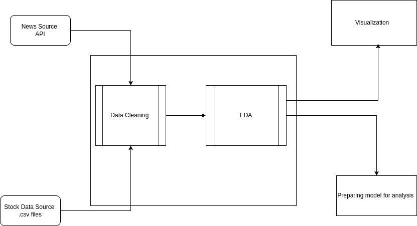
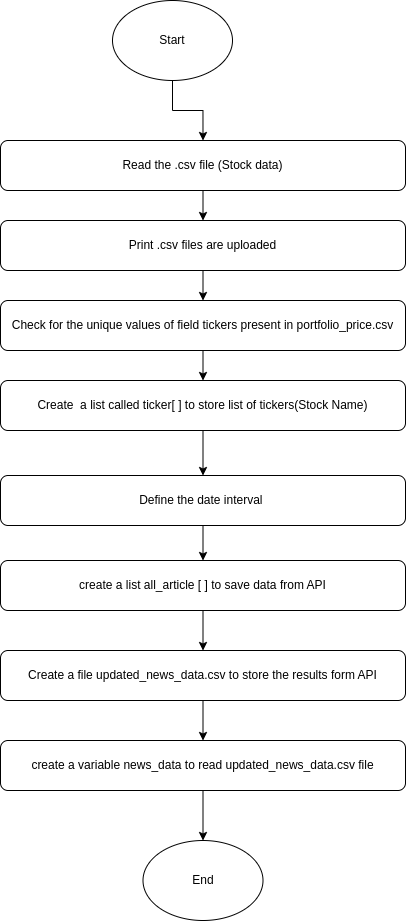
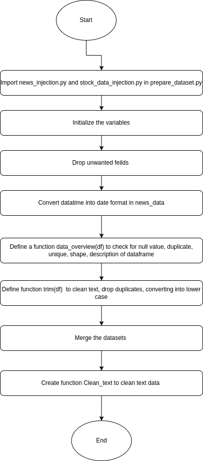

# Stock-Portfolio-Performance-and-News-Correlation-Analysis


# 📈 Stock Portfolio Performance and News Correlation Analysis

A Python-based financial data science project that analyzes the performance of a diversified stock portfolio, integrating historical stock price data with contemporaneous news events to explore the relationship between media narratives and stock return volatility.

---

## 🚀 Project Motivation

The objective of this study is to examine how external, market-moving news impacts stock price behavior and volatility. By synthesizing structured time-series financial data and unstructured textual news data, the project aims to identify hidden patterns, market anomalies, and actionable insights to inform investment strategies and forecasting models.

Additionally, this project demonstrates:
- The use of Python for structured financial data analysis.
- Advanced data preprocessing and feature engineering.
- Exploratory data analysis (EDA) combining numerical and textual datasets.
- Visualization of stock behavior and news-driven events.

---

## 📂 Datasets and Sources

1. **Portfolio Composition Dataset** (Kaggle)  
   - Contains stock tickers, share quantities, sector classifications, closing prices, and portfolio weights.
2. **Portfolio Historical Prices Dataset** (Kaggle)  
   - Provides daily open, high, low, close, adjusted prices, returns, and volume for each stock.
3. **Financial News Dataset** (Finnhub.io API)  
   - Retrieves real-time and historical news articles related to stocks, including headline, summary, date, source, and URL.

---
## Project Structure

├── prepare_dataset.py        # Data cleaning, merging, and text preprocessing
├── Stock_Portfolio.ipynb      # Main analysis notebook (EDA and visualizations)
├── README.md                  # Project documentation (this file)
├── data/                      # Directory for raw datasets
│    ├── portfolio.csv
│    ├── portfolio_prices.csv
│    └── news_data.json
└── requirements.txt           # Python package requirements


## 🛠 Installation and Requirements

To run this project, install the following Python libraries:

```bash
pip install pandas matplotlib seaborn wordcloud scikit-learn requests
``` 

Structure of Project 




## Flow chart 
Data Injection 




EDA




How to Run the Project

Clone the repository:
    git clone https://github.com/samyak-anand/Stock-Portfolio-Performance-and-News-Correlation-Analysis.git
    cd Stock-Portfolio-Performance-and-News-Correlation-Analysis


Install the necessary Python packages:
    pip install -r requirements.txt


Prepare your datasets:

    Download stock portfolio and pricing data from Kaggle.

    Set up your Finnhub.io API key in your environment variables or within your code

Run the preprocessing script:
    python prepare_dataset.py

Open and run the analysis notebook:
    jupyter notebook Stock_Portfolio.ipynb
